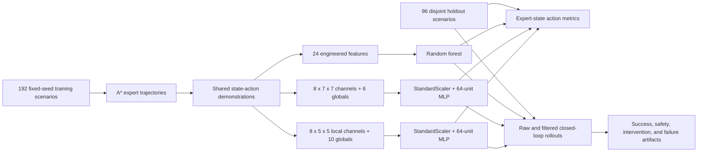

# Construction Embodied Agent Architecture

## System Boundary

The system accepts a natural-language task and structured grid state, then emits discrete simulator actions. It does not accept sensor streams or command hardware. One learned policy receives only a local agent-centered hazard window plus relative subgoal geometry, but all semantic values still come directly from simulator state rather than a perception subsystem.

## Components

| Component | Responsibility | Evidence boundary |
| --- | --- | --- |
| Task parser | Maps delivery, inspection, and charging phrases into `TaskSpec`. | Deterministic rules, not language-model reasoning. |
| Grid environment | Applies movement, task, reward, battery, and terminal transitions. | 2D discrete state machine, not physics. |
| Safety checks | Reject bounds, obstacle, restricted-zone, worker-zone, and battery violations. | Hand-authored simulator rules. |
| A* expert | Produces demonstrations and deterministic planning-reference episodes. | Full map access; not learned. |
| Engineered-state encoder | Produces 24 task, geometry, battery, safety, and distance features. | Privileged structured state. |
| Semantic-raster encoder | Produces eight 7x7 binary state channels and six global values. | Privileged structured state; no pixels or perception. |
| Egocentric encoder | Produces eight agent-centered 5x5 channels plus ten task/navigation values. | Off-window hazards hidden from classifier; relative subgoal retained. |
| Random-forest policy | Fits actions from engineered-state demonstrations. | Classical supervised imitation baseline. |
| World-raster MLP | Standardizes and classifies flattened full-grid semantic features. | One 64-unit hidden layer; no convolution, attention, or recurrence. |
| Egocentric MLP | Standardizes and classifies the local semantic window and global values. | One 64-unit hidden layer; no temporal memory or uncertainty output. |
| Action filter | Re-ranks actions after rejecting unsafe or task-invalid choices using full simulator rules. | Can see hazards hidden from the egocentric classifier; no expert task route or completion guarantee. |
| Evaluator | Measures expert-state classification and closed-loop holdout behavior. | Fixed-seed local regression protocol. |

## Training And Evaluation Flow

## Runtime Flow

1. Parse the instruction into a task type, subgoal, and terminal action.
2. Encode current state as engineered features, a world-frame semantic raster, or an agent-centered local window plus globals.
3. Rank action classes by classifier probability.
4. In raw mode, execute the top-ranked action.
5. In filtered mode, select the highest-ranked action that passes movement and task-context checks. Battery-reserve recovery may route only to a charger.
6. Record transitions and interventions.
7. Stop on completion or the scenario action limit.

## Design Decisions

- All three learned models share demonstrations and holdout scenarios so the representation comparison is controlled.
- The random forest is a compact CPU baseline for engineered features.
- The world-raster MLP deliberately consumes a flattened grid. Its poor result provides a baseline for spatially aligned observations and a future convolutional encoder.
- The egocentric MLP hides hazards outside a 5x5 window while retaining relative subgoal geometry. Its improvement isolates observation alignment, but its filter still uses privileged full-state rules.
- Closed-loop evaluation sits beside action accuracy because imitation errors shift later states.
- A* remains separate from learned policies and is never used for task-goal fallback.
- Generated model binaries are ignored; deterministic metrics, cards, reports, and diagrams are versioned.
