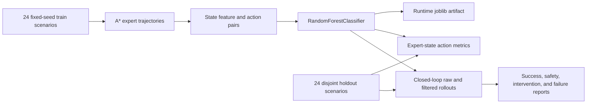

# Construction Embodied Agent Architecture

## System Boundary

The system accepts a natural-language task and fully observable structured grid state. It emits discrete simulator actions. It does not accept pixels, depth, point clouds, or robot sensor streams, and it does not command hardware.

## Components

| Component | Responsibility | Evidence boundary |
| --- | --- | --- |
| Task parser | Maps delivery, inspection, and charging phrases into a `TaskSpec`. | Deterministic rules, not language-model reasoning. |
| Grid environment | Applies movement, task, reward, battery, and terminal-state transitions. | 2D discrete simulator, not physics. |
| Safety checks | Reject out-of-bounds, obstacle, restricted-zone, worker-zone, and battery-invalid actions. | Simulator rules only. |
| A* expert | Produces cost-aware demonstrations and deterministic planning reference episodes. | Has full map access; not learned. |
| Feature encoder | Converts task phase, geometry, carrying state, battery, and local action safety into 24 numeric features. | Structured state only. |
| Behavior-cloning model | Fits a random-forest action classifier on expert state/action pairs. | Small classical model, not a foundation VLA. |
| Action safety filter | Re-ranks predicted actions by rejecting unsafe or task-invalid choices; a reserve controller can route only to a charger before depletion. | No expert route toward the task goal and no task-success guarantee. |
| Evaluator | Measures expert-state classification and closed-loop unseen-scenario behavior. | Fixed-seed local regression suite. |

## Training Flow

## Runtime Flow

1. Parse the instruction into a task type, subgoal, and terminal action.
2. Encode the current structured state into 24 numeric features.
3. Rank available action classes by model probability.
4. In raw mode, execute the highest-ranked action.
5. In filtered mode, choose the highest-ranked action that passes movement and task-context checks; when battery reserve is insufficient, temporarily route to the nearest charger.
6. Record each environment transition and each filter intervention.
7. Stop on task completion or the scenario action limit.

## Design Decisions

- Random forest was selected because it fits quickly on CPU, exposes a real learned decision boundary, and keeps local setup small.
- Procedural layouts use fixed but separate train and holdout seeds to make regression metrics reproducible while preventing identical scenario reuse.
- Closed-loop evaluation is reported beside action accuracy because imitation errors shift the state distribution.
- The A* task reference remains separate from the learned policies. The filtered policy can use shortest-path routing only for battery recovery, never as a fallback route toward the task goal.
- Runtime model binaries are ignored because joblib serialization can vary by environment; deterministic metrics and model metadata are versioned.
