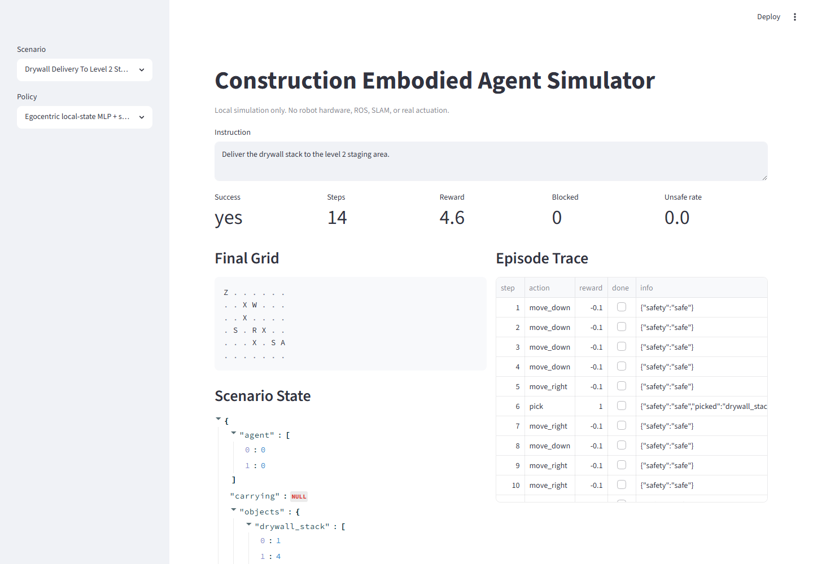
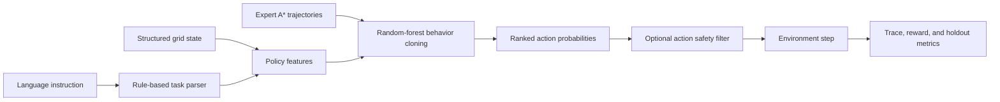

# Construction Embodied Agent Simulator

Local construction-site simulation for mapping language tasks and structured site state into action sequences. The project compares deterministic planning, naive and random baselines, and a real behavior-cloning policy trained from expert trajectories.

The repository folder retains its original `vla-embodied-agent-simulator` slug. “VLA-inspired” describes the language-state-action workflow only: this project is not a foundation vision-language-action model and does not consume images or language embeddings.

## What It Demonstrates

- Language-to-task parsing for delivery, inspection, and charging instructions.
- Grid environment with observations, rewards, traces, terminal states, and action safety checks.
- Construction-site constraints: obstacles, restricted zones, worker-proximity zones, slow zones, and battery limits.
- Deterministic A* planning plus random and naive-language baselines.
- Real random-forest behavior cloning trained on expert action demonstrations.
- Disjoint fixed-seed procedural train and holdout scenario sets.
- Raw and safety-filtered learned-policy evaluation with visible interventions and failures.
- Generated metrics, model card, failure analysis, replay traces, and focused tests.

## Evidence Snapshot

| Evaluation | Result | Interpretation |
| --- | --- | --- |
| Hand-authored simulator regression | A* safety-shielded planner completes `3/3` scenarios with `0.000` unsafe-action rate. | Planner and environment regression evidence only. |
| Holdout expert-action classification | `0.863` accuracy and `0.922` macro-F1 over 226 expert states from 24 unseen scenarios. | Measures imitation on expert states, not closed-loop control. |
| Raw behavior cloning | `0.500` success and `0.740` unsafe-action rate over 24 unseen scenarios. | Exposes compounding model error without repair. |
| Behavior cloning plus safety filter | `0.625` success, `0.000` unsafe-action rate, and 207 interventions. | Safety filtering blocks unsafe/task-invalid actions but does not guarantee task completion. |
| A* planning reference on holdout | `1.000` success and `0.000` unsafe-action rate. | Oracle-style deterministic planning reference, not a learned policy. |

These values come from fixed local seeds and the bundled simulator. They are not robotics benchmark, hardware, or physical-safety results.



## Run

```bash
streamlit run projects/vla-embodied-agent-simulator/app.py
```

Generate both rule-policy and learned-policy artifacts:

```bash
python projects/vla-embodied-agent-simulator/evaluate_vla.py
```

Run the focused tests:

```bash
python -m pytest tests/test_vla_embodied_agent.py
```

The fitted `behavior_cloning_policy.joblib` file is generated under `.artifacts/vla-embodied-agent-simulator/` and ignored by Git. Deterministic metrics and reports are versioned in `demo_outputs/`.

## Evaluation Evidence

- `src/vla_embodied_agent_simulator/environment.py`: state, actions, rewards, safety checks, scenarios, and A* route planning.
- `src/vla_embodied_agent_simulator/policies.py`: random, naive-language, and deterministic safety-shielded baselines.
- `src/vla_embodied_agent_simulator/learning.py`: procedural splits, feature encoding, real classifier fitting, learned policy rollout, safety filter, and failure reporting.
- `src/vla_embodied_agent_simulator/evaluation.py`: repeatable hand-authored scenario evaluation and artifact generation.
- `demo_outputs/behavior_cloning_eval_report.md`: learned-policy action and closed-loop holdout metrics.
- `demo_outputs/behavior_cloning_failure_analysis.md`: failed learned-policy holdout episodes.
- `demo_outputs/behavior_cloning_model_card.md`: inputs, outputs, training source, and non-capabilities.
- `demo_outputs/sample_episode_replay.md`: step-by-step deterministic planner replay.
- `tests/test_vla_embodied_agent.py`: parsing, safety, split, training, holdout, and artifact regression tests.

## Architecture



See [ARCHITECTURE.md](ARCHITECTURE.md) for component and data-flow details.

## Evaluation Design

- Eight train and eight holdout scenarios are generated for each task type: delivery, inspection, and charging.
- Train and holdout generators use different fixed seeds and disjoint scenario IDs.
- Expert A* actions provide supervised labels for behavior cloning.
- Action accuracy and macro-F1 are measured on holdout expert states.
- Closed-loop success, reward, unsafe attempts, blocked actions, and interventions are measured on complete unseen episodes.
- No expert fallback toward the task goal is supplied to either learned policy during evaluation. The filtered policy may route only to a charger when battery reserve is insufficient.

See [EVAL.md](EVAL.md) for metric definitions and leakage controls.

## Limitations

- Structured 7x7 grids only; no camera, depth, point cloud, 3D physics, or real construction-site telemetry.
- Rule-based language parsing; no language encoder or free-form instruction generalization benchmark.
- Random-forest action classifier; not a foundation VLA, deep policy, or reinforcement-learning result.
- Expert demonstrations come from the same simulator's A* planner.
- The action safety filter enforces simulator rules only and cannot establish real-world robot safety.
- Twenty-four holdout scenarios are useful regression evidence, not a standard robotics benchmark.
- No ROS, Isaac Sim, Gazebo, SLAM, motion planning, actuation, sim-to-real, or hardware testing.

See [LIMITATIONS.md](LIMITATIONS.md) for failure modes and claim boundaries.

## Credible Next Steps

- Add visual observations and compare structured-state behavior cloning with image-conditioned policies.
- Add Gymnasium interfaces and a learned RL baseline on the same held-out scenario protocol.
- Add richer procedural layouts, dynamic workers, partial observability, and out-of-distribution tests.
- Add ROS 2 or Isaac Sim adapters as offline interfaces before any hardware claim.
- Validate task definitions and safety constraints with construction robotics practitioners.

## Evidence

Embodied-AI simulation, real supervised policy fitting, train/holdout discipline, closed-loop evaluation, action masking, safety interventions, baseline comparison, and honest failure analysis.

## Implementation Notes

- High action accuracy is not presented as control success; the lower closed-loop rate demonstrates compounding imitation error.
- The raw learned policy is retained because its failures show what the safety filter changes.
- The filtered policy has no A* fallback toward the task goal. A separate battery-reserve controller may route only to a charger, so unresolved task failures remain visible.
- The fitted model binary is a runtime artifact while deterministic evidence remains reviewable in Git.

## Design Decisions

- Why expert-state action accuracy overestimates closed-loop policy quality.
- How train/holdout scenario leakage is prevented and tested.
- Which unsafe or task-invalid actions the runtime filter rejects.
- Why an A* expert is a useful reference but not evidence of learned planning.
- What perception, dynamics, middleware, and physical validation would be required for real construction robotics.
