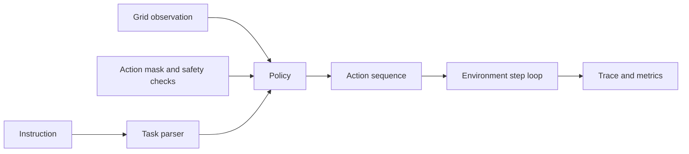

# VLA Embodied Agent Simulator

Construction-site embodied AI simulation for mapping natural-language tasks into safe action sequences. The project is intentionally local and deterministic so reviewers can inspect the environment, policy behavior, traces, and safety metrics without robot hardware.

This is not a real robot deployment. It does not claim ROS integration, SLAM, perception hardware, learned control, or validated physical safety.

## What It Demonstrates

- Language-to-task parsing for delivery, inspection, and charging instructions.
- Gym-style grid environment with observations, action masks, rewards, traces, and terminal states.
- Site constraints: obstacles, restricted zones, worker-proximity zones, slow zones, and battery limits.
- Three policy baselines: random, naive language, and safety-shielded route planning.
- Evaluation artifacts with success rate, unsafe action rate, blocked actions, rewards, and replay traces.

## Scenarios

| Scenario | Task | Safety pressure |
| --- | --- | --- |
| Drywall Delivery To Level 2 Staging | Pick up a drywall stack and deliver it to a staging area. | Direct route is blocked, so safe planning must detour around obstacles and restricted zones. |
| Blocked Corridor Inspection | Reach and inspect a corridor area near the lift lobby. | Goal is near worker and restricted zones. |
| Low Battery Return To Charger | Return to the charging dock. | Battery is low and the path contains blocked and slow cells. |

## Run

```bash
streamlit run projects/vla-embodied-agent-simulator/app.py
```

Generate evaluation artifacts:

```bash
python projects/vla-embodied-agent-simulator/evaluate_vla.py
```

Run the focused tests:

```bash
python -m pytest tests/test_vla_embodied_agent.py tests/test_general_ai_projects.py
```

## Reviewer Evidence

- `src/vla_embodied_agent_simulator/environment.py`: environment state, actions, rewards, action safety, scenarios, and A* route planning.
- `src/vla_embodied_agent_simulator/policies.py`: random, naive language, and safety-shielded policy baselines.
- `src/vla_embodied_agent_simulator/evaluation.py`: repeatable episode evaluation and artifact generation.
- `demo_outputs/vla_eval_report.md`: metrics comparing baseline and shielded policies.
- `demo_outputs/sample_episode_replay.md`: step-by-step replay for a successful shielded episode.
- `tests/test_vla_embodied_agent.py`: regression tests for parsing, safety behavior, metrics, and artifact creation.

## Architecture



## Current Results

The expected evaluation pattern is:

- `safety_shielded` completes all included scenarios with zero unsafe actions.
- `naive_language` can parse the task but may collide with blocked worksite cells because it follows direct Manhattan movement.
- `random` is included only as a weak action-space baseline.

Regenerate `demo_outputs/` after changing scenarios or policies.

## Reviewer Signal

This project shows embodied-AI engineering judgment in a small, inspectable form: task parsing, state transitions, action masking, safety constraints, baseline comparison, evaluation artifacts, and honest simulation boundaries.

## Engineering Notes

- The environment records every transition so action choices and failures can be reviewed step by step.
- A* route planning uses simulator safety checks instead of letting the planner pass through blocked cells.
- The naive baseline is intentionally simple, which makes the value of route planning and safety checks visible in the metrics.
- The Streamlit app exposes scenarios, policies, final grid state, trace rows, and policy-level evaluation in one local view.

## Technical Review Discussion Points

- How language instructions become task specs, target objects, target zones, and success actions.
- How action masks reject out-of-bounds moves, obstacles, restricted zones, worker-proximity cells, and battery-depleted actions.
- Why the random and naive policies are useful baselines even though they are weak.
- What would be required before claiming real embodied-AI deployment: perception, simulation benchmarks, ROS/simulator bridges, hardware tests, and safety validation.

## Limitations

- Grid world only; no camera observations, 3D simulation, physics, ROS, SLAM, or robot actuation.
- Rule-based language parsing, not a foundation VLA model.
- Safety checks are simulator constraints, not real-world robot safety validation.
- Rewards and metrics are useful for regression tests, not for claiming deployed robotics performance.

## Credible Next Steps

- Add Gymnasium wrappers and train a small policy against the same action mask.
- Add visual observations rendered from the grid and compare language-only versus vision-state policies.
- Add ROS 2 or Isaac Sim adapters as offline interfaces before any hardware claim.
- Add scenario files for Singapore construction-site workflows, including lift-lobby access, temporary works zones, and material handling routes.
