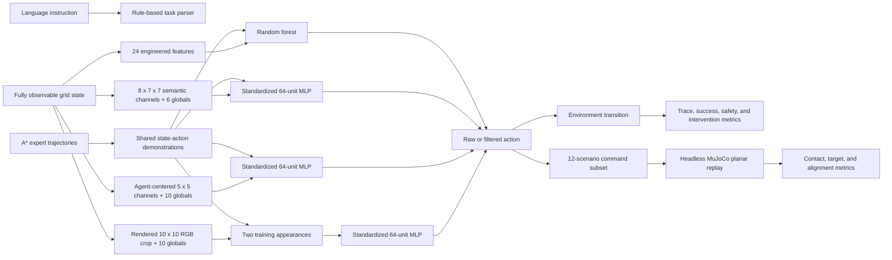

# Construction Embodied Agent Simulator

A local construction-site agent testbed for evaluating how task parsing, observation design, imitation learning, appearance shift, action filtering, and a continuous command boundary affect behavior. Four learned policy families share the same expert demonstrations and disjoint holdout layouts: an engineered-state random forest, a world-frame semantic-raster MLP, an egocentric local-state MLP, and an MLP over rendered egocentric RGB pixels plus bounded task telemetry. A separate headless MuJoCo adapter replays selected policy commands as continuous planar rigid-body motion.

**Claim boundary:** the semantic observations and RGB renderer are generated directly from privileged simulator state. The RGB classifier consumes actual pixel values, but not images from a physical or photorealistic simulated camera. All local classifiers see a 5x5 crop plus relative subgoal geometry; the safety filter still has full simulator-rule access. MuJoCo replays planar cell targets against rigid obstacle and exclusion proxies; it is not a mobile-robot model or controller validation. This project does not establish object detection, depth, realistic sensor handling, learned language grounding, a foundation vision-language-action model, ROS integration, hardware control, or physical safety.


## Evidence Snapshot

The evaluator generates 192 training and 96 holdout scenarios across delivery, inspection, and charging tasks. Train and holdout seeds and scenario IDs are disjoint.

| Policy / reference | Holdout action accuracy | Closed-loop success | Unsafe-action rate | Interpretation |
| --- | ---: | ---: | ---: | --- |
| Engineered state + random forest, raw | `0.855` | `0.646` | `0.674` | Strong expert-state imitation does not prevent compounding rollout errors. |
| Engineered state + random forest, filtered | `0.855` | `0.698` | `0.000` | The filter blocks observed simulator-rule violations; it does not guarantee completion. |
| Semantic raster + 64-unit MLP, raw | `0.478` | `0.031` | `0.682` | Flattening a state raster performs poorly with this dataset and model. |
| Semantic raster + 64-unit MLP, filtered | `0.478` | `0.292` | `0.000` | Filtering suppresses observed violations but requires 3,529 interventions. |
| Egocentric local state + 64-unit MLP, raw | `0.834` | `0.573` | `0.595` | Agent-centered encoding recovers action accuracy, but the unfiltered policy remains unsafe. |
| Egocentric local state + 64-unit MLP, filtered | `0.834` | `0.760` | `0.000` | Highest learned-policy completion, with 943 interventions from full-state rules. |
| Synthetic RGB crop + 64-unit MLP, raw | `0.813` | `0.635` | `0.041` | Rendered pixels support the standard appearance, but task-error rate is `0.489`. |
| Synthetic RGB crop + 64-unit MLP, filtered | `0.813` | `0.719` | `0.000` | Standard appearance requires 965 full-state filter interventions. |
| Same RGB model, unseen work-light palette, raw | `0.417` | `0.000` | `0.472` | Appearance shift exposes complete raw closed-loop failure. |
| Same RGB model, unseen work-light palette, filtered | `0.417` | `0.427` | `0.000` | Filtering recovers partial completion but requires 3,315 interventions. |
| Deterministic A* reference | Not applicable | `1.000` | `0.000` | Full-map oracle-style planning reference, not learned behavior. |

The world-frame MLP result is retained as negative evidence. Agent-centered local encoding recovers `0.356` action accuracy and `0.468` filtered success over that baseline. It reaches filtered success `0.062` above the random forest while trailing the random forest's action accuracy by `0.021`. Replacing all RGB pixels with their training-set means reduces action accuracy from `0.813` to `0.474`, showing that the image contributes beyond the ten telemetry values. The unseen palette then reduces action accuracy by `0.396` and filtered success by `0.292`. Success requires a task-specific terminal event; timeout and nonterminal battery recovery are failures. These are synthetic observation and robustness results, not physical-camera perception or autonomous robot safety.

## Physics Command Replay

The evaluator selects four delivery, four inspection, and four charging scenarios from the unseen split. It replays the raw egocentric policy, its full-state filtered variant, and the A* reference through a MuJoCo body with two planar slide joints and bounded position actuators. Floor contact is ignored; contacts with named rigid obstacles, boundaries, restricted-area proxies, and worker proxies are recorded.

| Policy | Physics scenarios | Movement commands | Reached target | Contact commands | Contact rate | Max final alignment error |
| --- | ---: | ---: | ---: | ---: | ---: | ---: |
| Egocentric MLP, raw | 12 | 150 | `0.660` | 51 | `0.340` | `0.0290 m` |
| Egocentric MLP, filtered | 12 | 148 | `1.000` | 0 | `0.000` | `0.0290 m` |
| A* reference | 12 | 98 | `1.000` | 0 | `0.000` | `0.0290 m` |


The contact difference confirms that the command adapter and rigid collision geometry expose blocked raw actions and that the existing rule filter suppresses them on this fixed subset. It does not validate wheel dynamics, acceleration limits, localization, moving workers, or real collision avoidance. Blocked commands are returned to the discrete result cell before the next command to preserve trace alignment; that reset is not a learned or engineered recovery controller.

## Implemented Scope

- Rule-based parsing for delivery, inspection, and charging instructions.
- A 7x7 environment with obstacles, restricted areas, worker zones, slow zones, battery state, rewards, terminal states, and episode traces.
- A* expert trajectories and deterministic planning-reference rollouts.
- A 24-feature engineered-state encoder with a random-forest action classifier.
- An eight-channel semantic state raster plus six global features with a one-hidden-layer MLP classifier.
- An agent-centered 5x5 semantic window plus ten task/navigation values with a second one-hidden-layer MLP.
- A deterministic 10x10 RGB renderer over the same 5x5 local crop, two training appearances, and a held-out work-light appearance.
- A 64-unit MLP over 300 normalized RGB values plus ten task/navigation values.
- Raw and safety-filtered closed-loop evaluation for all four learned policy families, including the unseen RGB appearance.
- Headless MuJoCo planar command replay with bounded actuators, rigid contacts, trace alignment, and a balanced 12-scenario learned-policy subset.
- Versioned metrics, model cards, failure analysis, replay traces, and generated visual evidence.
- Focused tests for parsing, simulation safety, terminal success semantics, split isolation, observation schemas, training, filtering, rigid contacts, replay determinism, and artifact generation.

## Run Locally

From the repository root:

```bash
python -m pip install -r projects/vla-embodied-agent-simulator/requirements.txt
streamlit run projects/vla-embodied-agent-simulator/app.py
```

The policy selector distinguishes semantic state, egocentric local state, standard rendered RGB, and shifted rendered RGB. The RGB input is synthetic and state-rendered; it is not a physical-camera stream.

Regenerate all evaluation artifacts:

```bash
python projects/vla-embodied-agent-simulator/evaluate_vla.py
```

Run the focused tests:

```bash
python -m pytest tests/test_vla_embodied_agent.py
```

The generated `joblib` models are written under `.artifacts/vla-embodied-agent-simulator/` and ignored by Git. Deterministic reports and metrics are versioned in `demo_outputs/`.

## Evidence Map

| Evidence | File |
| --- | --- |
| Exact split, model, action, and rollout metrics | [`demo_outputs/behavior_cloning_eval_summary.json`](demo_outputs/behavior_cloning_eval_summary.json) |
| Human-readable representation comparison | [`demo_outputs/behavior_cloning_eval_report.md`](demo_outputs/behavior_cloning_eval_report.md) |
| Failed holdout episodes for all learned policies | [`demo_outputs/behavior_cloning_failure_analysis.md`](demo_outputs/behavior_cloning_failure_analysis.md) |
| Engineered-state model boundary | [`demo_outputs/behavior_cloning_model_card.md`](demo_outputs/behavior_cloning_model_card.md) |
| Semantic-raster model and non-capabilities | [`demo_outputs/semantic_raster_model_card.md`](demo_outputs/semantic_raster_model_card.md) |
| Egocentric observation contract and filter dependence | [`demo_outputs/egocentric_mlp_model_card.md`](demo_outputs/egocentric_mlp_model_card.md) |
| Rendered-pixel contract and appearance-shift result | [`demo_outputs/synthetic_rgb_mlp_model_card.md`](demo_outputs/synthetic_rgb_mlp_model_card.md) |
| Standard and shifted RGB inputs | [`day`](demo_outputs/synthetic_rgb_observation_day.png) / [`work-light`](demo_outputs/synthetic_rgb_observation_worklight.png) |
| MuJoCo command/contact metrics | [`demo_outputs/physics_replay_summary.json`](demo_outputs/physics_replay_summary.json) |
| Physics replay interpretation and diagram | [`report`](demo_outputs/physics_replay_report.md) / [`comparison`](demo_outputs/physics_replay_comparison.svg) |
| Architecture and data flow | [`ARCHITECTURE.md`](ARCHITECTURE.md) |
| Evaluation protocol and leakage controls | [`EVAL.md`](EVAL.md) |
| Failure and deployment boundaries | [`LIMITATIONS.md`](LIMITATIONS.md) |
| Contract and regression tests | [`../../tests/test_vla_embodied_agent.py`](../../tests/test_vla_embodied_agent.py) |

## Architecture



See [`ARCHITECTURE.md`](ARCHITECTURE.md) for component responsibilities and the runtime boundary.

## Evaluation Protocol

- Training split: 64 scenarios per task type, 192 total, 1,830 expert steps.
- Holdout split: 32 scenarios per task type, 96 total, 948 expert steps.
- Train seed: `1701`; holdout seed: `2903`.
- Expert-state metrics: action accuracy and macro-F1.
- Closed-loop metrics: success, steps, reward, unsafe actions, task errors, blocked actions, and filter interventions.
- Learned policies do not call A* for task-goal recovery. A separate reserve controller may route only to a charger when battery is insufficient.

## Limitations

- The policy environment is a fully observable discrete grid. MuJoCo is a separate planar command replay, not a coupled training environment or mobile-robot dynamics model.
- Semantic channels are privileged state, not sensed or predicted observations. The egocentric classifier hides off-window hazards, but its filter does not.
- All three MLPs are small supervised baselines without convolution, recurrence, attention, memory, uncertainty estimation, or learned language conditioning.
- The RGB renderer produces clean categorical colors from privileged state. It does not model detection, depth, calibration, blur, occlusion, or realistic sensor noise.
- The unseen work-light palette causes severe degradation, including zero raw closed-loop completion.
- Expert labels come from the same simulator's A* planner.
- Fixed-seed procedural layouts provide reproducible regression evidence, not benchmark-scale robotics coverage.
- Simulator-rule filtering cannot establish real-world robot safety.
- There is no wheel or leg kinematics, actuator identification, ROS, SLAM, manipulation, sim-to-real transfer, field testing, or hardware validation.

## Next Steps

1. Add controlled blur, occlusion, geometric perturbation, and uncertainty-aware abstention to the RGB policy.
2. Compare the flat RGB MLP with a convolutional encoder under the same split and parameter budget.
3. Add out-of-distribution layouts and dynamic worker trajectories.
4. Introduce a Gymnasium interface and an RL baseline without changing the holdout protocol.
5. Replace the planar command body with a kinematically accurate mobile base and offline ROS 2 interface before making a robot-controller or middleware claim.
