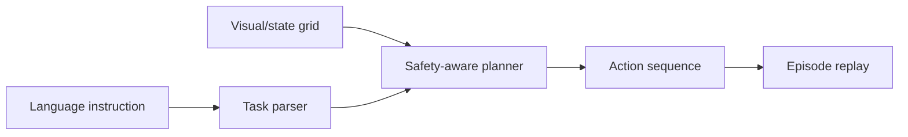

# VLA Embodied Agent Simulator

VLA-inspired simulation that maps natural-language instructions and grid-world state into safe action sequences. This is not a real robot deployment.

## Problem

Robotics/VLA systems need to connect instructions, observations, state, actions, and safety constraints before touching hardware.

## Demo

```bash
streamlit run projects/vla-embodied-agent-simulator/app.py
```

## Features

- Simulated grid-world state
- Natural-language task parser
- Rule-based baseline planner
- Safety constraints and invalid-action handling
- Episode trace and text renderer
- Success/failure metrics through tests

## Tech Stack

Python, Streamlit, dataclass environment, pytest.

## Architecture



## Limitations

- Grid-world only.
- No real vision model, robot hardware, ROS, or learned policy.

## Deployment-Relevant Extensions

- Add Gymnasium integration, learned policies, richer visual observations, and robotics simulation.
- Add ROS 2 bridge and safety validation before hardware use.

## Reviewer Signal

VLA concepts, embodied AI simulation, action planning, robotics safety thinking, and practical environment design.

## Engineering Notes

- The simulator connects language goals, grid-world state, valid actions, and safety checks to demonstrate the core VLA loop in a lightweight form.
- A rule-based planner is used as a clear baseline before introducing learned policies or perception models.
- The environment records traces so action choices and failures can be inspected step by step.
- A deployable embodied-AI system would require richer observations, learned policies, simulation benchmarks, ROS/simulator bridges, and hardware safety validation.

## Technical Review Discussion Points

- Reviewers can assess how the project approximates a vision-language-action loop.
- Instructions become actions under state, validity, and safety constraints.
- The simple environment makes embodied-agent behavior easier to debug and inspect.
- The architecture can extend toward Gymnasium, Isaac Sim, Habitat, or ROS 2.
- The project highlights the portfolio's embodied AI specialization and construction robotics direction.

