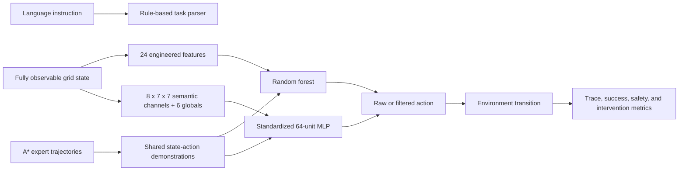

# Construction Embodied Agent Simulator

A local 2D construction-site simulator for evaluating how task parsing, observation design, imitation learning, and action filtering affect closed-loop behavior. The implementation compares an engineered-state random forest with a neural MLP over a semantic state raster, using the same expert demonstrations and disjoint holdout layouts.

**Claim boundary:** the semantic raster is generated from fully observable simulator state. This project does not consume camera images, learn visual perception, use a language embedding, implement a foundation vision-language-action model, command robot hardware, or establish physical safety.


## Evidence Snapshot

The evaluator generates 192 training and 96 holdout scenarios across delivery, inspection, and charging tasks. Train and holdout seeds and scenario IDs are disjoint.

| Policy / reference | Holdout action accuracy | Closed-loop success | Unsafe-action rate | Interpretation |
| --- | ---: | ---: | ---: | --- |
| Engineered state + random forest, raw | `0.855` | `0.646` | `0.674` | Strong expert-state imitation does not prevent compounding rollout errors. |
| Engineered state + random forest, filtered | `0.855` | `0.698` | `0.000` | The filter blocks observed simulator-rule violations; it does not guarantee completion. |
| Semantic raster + 64-unit MLP, raw | `0.478` | `0.031` | `0.682` | Flattening a state raster performs poorly with this dataset and model. |
| Semantic raster + 64-unit MLP, filtered | `0.478` | `0.469` | `0.000` | Filtering improves safety and completion but requires 3,617 interventions. |
| Deterministic A* reference | Not applicable | `1.000` | `0.000` | Full-map oracle-style planning reference, not learned behavior. |

The MLP result is retained as negative evidence. It is `0.377` below the random forest in expert-state action accuracy and `0.229` below it in filtered closed-loop success. The comparison points to insufficient data and the loss of spatial structure in a flattened raster; it is not presented as a perception result.

## Implemented Scope

- Rule-based parsing for delivery, inspection, and charging instructions.
- A 7x7 environment with obstacles, restricted areas, worker zones, slow zones, battery state, rewards, terminal states, and episode traces.
- A* expert trajectories and deterministic planning-reference rollouts.
- A 24-feature engineered-state encoder with a random-forest action classifier.
- An eight-channel semantic state raster plus six global features with a one-hidden-layer MLP classifier.
- Raw and safety-filtered closed-loop evaluation for both learned policies.
- Versioned metrics, model cards, failure analysis, replay traces, and generated visual evidence.
- Focused tests for parsing, simulation safety, split isolation, observation schemas, training, filtering, and artifact generation.

## Run Locally

From the repository root:

```bash
python -m pip install -r projects/vla-embodied-agent-simulator/requirements.txt
streamlit run projects/vla-embodied-agent-simulator/app.py
```

The policy selector identifies the neural option as a **semantic state-raster MLP**. It does not imply camera input.

Regenerate all evaluation artifacts:

```bash
python projects/vla-embodied-agent-simulator/evaluate_vla.py
```

Run the focused tests:

```bash
python -m pytest tests/test_vla_embodied_agent.py
```

The generated `joblib` models are written under `.artifacts/vla-embodied-agent-simulator/` and ignored by Git. Deterministic reports and metrics are versioned in `demo_outputs/`.

## Evidence Map

| Evidence | File |
| --- | --- |
| Exact split, model, action, and rollout metrics | [`demo_outputs/behavior_cloning_eval_summary.json`](demo_outputs/behavior_cloning_eval_summary.json) |
| Human-readable representation comparison | [`demo_outputs/behavior_cloning_eval_report.md`](demo_outputs/behavior_cloning_eval_report.md) |
| Failed holdout episodes for all learned policies | [`demo_outputs/behavior_cloning_failure_analysis.md`](demo_outputs/behavior_cloning_failure_analysis.md) |
| Engineered-state model boundary | [`demo_outputs/behavior_cloning_model_card.md`](demo_outputs/behavior_cloning_model_card.md) |
| Semantic-raster model and non-capabilities | [`demo_outputs/semantic_raster_model_card.md`](demo_outputs/semantic_raster_model_card.md) |
| Architecture and data flow | [`ARCHITECTURE.md`](ARCHITECTURE.md) |
| Evaluation protocol and leakage controls | [`EVAL.md`](EVAL.md) |
| Failure and deployment boundaries | [`LIMITATIONS.md`](LIMITATIONS.md) |
| Contract and regression tests | [`../../tests/test_vla_embodied_agent.py`](../../tests/test_vla_embodied_agent.py) |

## Architecture



See [`ARCHITECTURE.md`](ARCHITECTURE.md) for component responsibilities and the runtime boundary.

## Evaluation Protocol

- Training split: 64 scenarios per task type, 192 total, 1,830 expert steps.
- Holdout split: 32 scenarios per task type, 96 total, 948 expert steps.
- Train seed: `1701`; holdout seed: `2903`.
- Expert-state metrics: action accuracy and macro-F1.
- Closed-loop metrics: success, steps, reward, unsafe actions, task errors, blocked actions, and filter interventions.
- Learned policies do not call A* for task-goal recovery. A separate reserve controller may route only to a charger when battery is insufficient.

## Limitations

- The environment is a fully observable discrete grid, not a physics simulator.
- The semantic channels are privileged state, not sensed or predicted observations.
- The MLP is a small supervised baseline without convolution, recurrence, attention, or language conditioning.
- Expert labels come from the same simulator's A* planner.
- Fixed-seed procedural layouts provide reproducible regression evidence, not benchmark-scale robotics coverage.
- Simulator-rule filtering cannot establish real-world robot safety.
- There is no ROS, SLAM, motion control, manipulation, sim-to-real transfer, field testing, or hardware validation.

## Next Steps

1. Add partial observability and controlled sensor noise before introducing image-based observations.
2. Compare the flat MLP with a convolutional encoder under the same split and parameter budget.
3. Add out-of-distribution layouts and dynamic worker trajectories.
4. Introduce a Gymnasium interface and an RL baseline without changing the holdout protocol.
5. Add offline ROS 2 or Isaac Sim adapters before making any middleware or robotics-integration claim.
